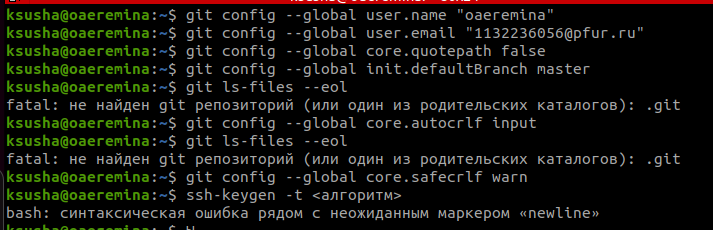
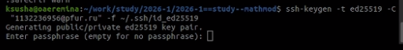
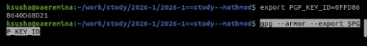
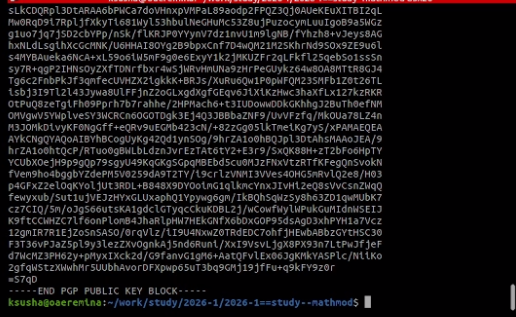
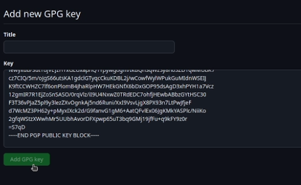
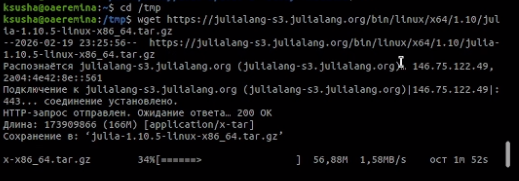
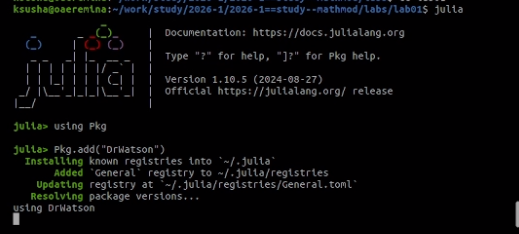
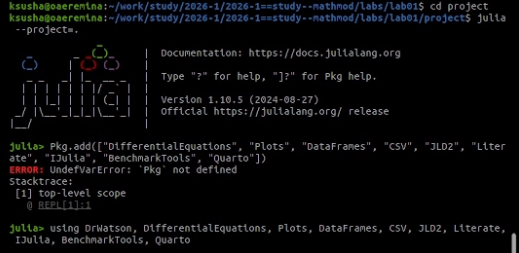
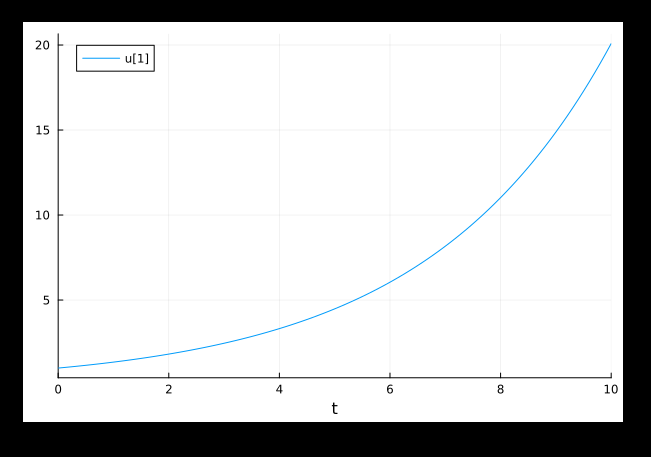
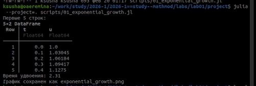

# Информация

## Докладчик

:::::::::::::: {.columns align=center}
::: {.column width="70%"}

  * Еремина Оксана
  * студентка НКА
  * Российский университет дружбы народов
  * [1132236056@pfur.ru](mailto:1132236056@pfur.ru)
  * <https://oaeremina.github.io/ru/>

:::
::: {.column width="25%"}

:::
::::::::::::::

## Цель работы

Приобрести практические навыки работы с системой управления версиями Git.

## Задания

1. Настроить Git и создать SSH/GPG ключи
2. Установить Julia и необходимые пакеты
3. Создать проект DrWatson
4. Реализовать модель экспоненциального роста
5. Освоить литературное программирование
6. Провести параметрическое исследование

## 1. Настройка Git

### Установка Git:

- sudo apt update
- sudo apt install git gh git-flow -y

### Выполнена настройка:

- git config --global user.name "Оксана Еремина"
- git config --global user.email "1132236956@pfur.ru"
- git config --global core.autocrlf input

{#fig:001 width=70%}

### Создан SSH-ключ:

- ssh-keygen -t ed25519 -C "1132236956@pfur.ru" -f ~/.ssh/id_ed25519

{#fig:002 width=70%}

{#fig:003 width=70%}

### Создан GPG-ключ:

- gpg --full-generate-key

{#fig:004 width=70%}

{#fig:005 width=70%}

{#fig:006 width=70%}

### Настроена подпись коммитов:

- git config --global user.signingkey
- git config --global commit.gpgsign true

## 2. Создание рабочего каталога

- mkdir -p ~/work/study/2026-1
- cd ~/work/study/2026-1
- mkdir "2026-1==study--mathmod"
- cd "2026-1==study--mathmod"

### Использован шаблон курса:

- git clone https://github.com/yamadharma/course-directory-student-template.git tmp-template
- cp -r tmp-template/* tmp-template/.* . 2>/dev/null || true
- rm -rf tmp-template
- echo "mathmod" > COURSE
- make prepare
- git init
- git add .
- git commit -m "initial: course structure"

## 3. Установка Julia

- cd /tmp
- wget https://julialang-s3.julialang.org/bin/linux/x64/1.10/julia-1.10.5-linux-x86_64.tar.gz
- sudo tar -xvzf julia-1.10.5-linux-x86_64.tar.gz -C /opt/
- sudo ln -s /opt/julia-1.10.5/bin/julia /usr/local/bin/julia
- julia --version

{#fig:007 width=70%}

## 4. Создание проекта DrWatson

- cd ~/work/study/2026-1/2026-1==study--mathmod/labs
- mkdir lab01
- cd lab01
- julia

### julia
- using Pkg
- Pkg.add("DrWatson")
- using DrWatson
- initialize_project("project"; authors="Ксения Еремина", git=false)
- exit()

{#fig:008 width=70%}

- cd project
- julia --project=.

### julia
- Pkg.add(["DifferentialEquations", "Plots", "DataFrames", "CSV", "JLD2", "Literate", "IJulia", "BenchmarkTools", "Quarto"])
- using DrWatson, DifferentialEquations, Plots, DataFrames, CSV, JLD2, Literate, IJulia, BenchmarkTools, Quarto
- exit()

{#fig:009 width=70%}

## 5. Модель экспоненциального роста

Создан файл scripts/01_exponential_growth.jl:

### julia
- using DrWatson
- @quickactivate "project"
- using DifferentialEquations
- using Plots
- using DataFrames

- function exponential_growth!(du, u, p, t)
   -  α = p
   -  du[1] = α * u[1]
- end

- u0 = [1.0]
- α = 0.3
- tspan = (0.0, 10.0)

- prob = ODEProblem(exponential_growth!, u0, tspan, α)
- sol = solve(prob, Tsit5(), saveat=0.1)

- df = DataFrame(t=sol.t, u=first.(sol.u))
- println("Первые 5 строк:")
- println(first(df, 5))

- doubling_time = log(2) / α
- println("Время удвоения: ", round(doubling_time; digits=2))

- plot(sol, label="u(t)", xlabel="Время t", ylabel="Популяция u", title="Экспоненциальный рост (α = $α)")
- savefig("exponential_growth.png")

{#fig:010 width=70%}

- Результат выполнения:
- Первые 5 строк: (0.0, 1.0), (0.1, 1.03), (0.2, 1.06), (0.3, 1.09), (0.4, 1.13)
- Время удвоения: 2.31

{#fig:011 width=70%}

## 6. Литературное програмиирование 

Файл дополнен Markdown комментрариями 
Создан скрипт scripts/tangle.jl для генерации форматов.

Запуск:
- julia --project=. scripts/tangle.jl scripts/01_exponential_growth.jl

Созданы файлы:

scripts/01_exponential_growth/01_exponential_growth.jl (чистый код)

markdown/01_exponential_growth/01_exponential_growth.qmd (Quarto)

notebooks/01_exponential_growth/01_exponential_growth.ipynb (Jupyter)

## 7. Параметрическое исследование 

- Создан файл scripts/02_exponential_growth.jl с исследованием для α = [0.1, 0.3, 0.5, 0.8, 1.0].
- Полученные значения времени удвоения совпадают с теоретической формулой t₂ = ln2/α.

# Выводы

В процессе выполнения данной лабораторной работы я приобрела практические навыки работы с Git.
