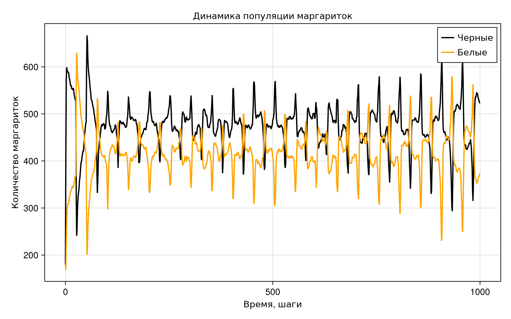
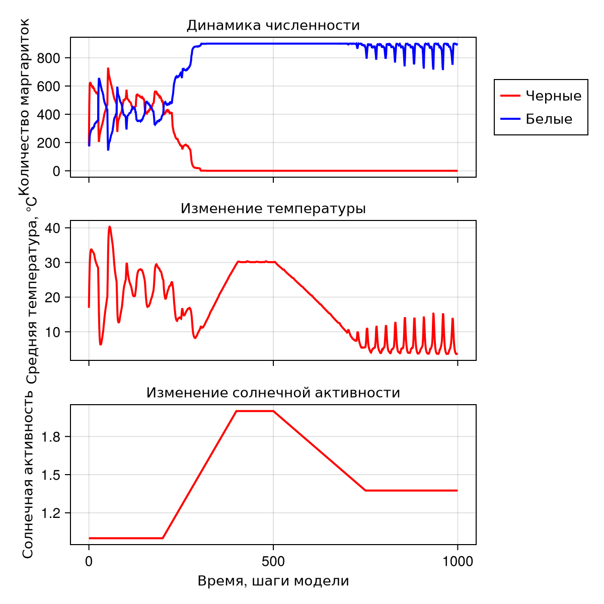
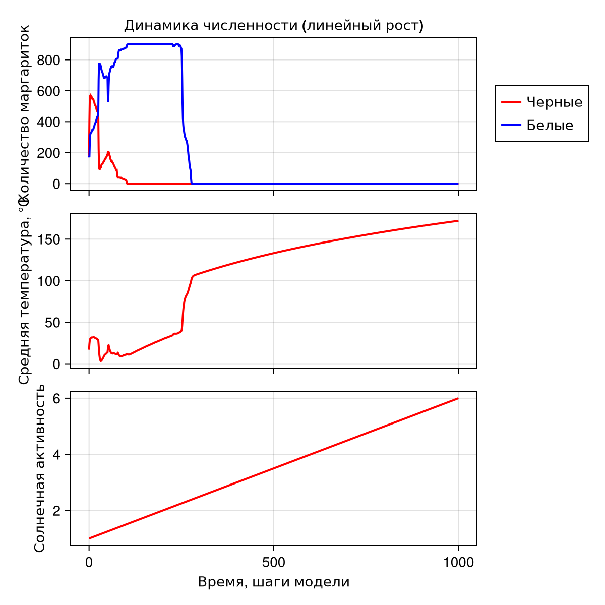
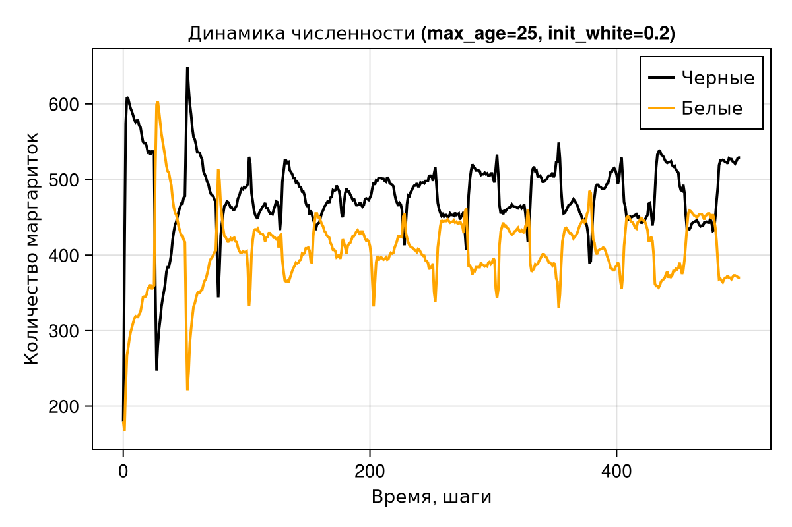
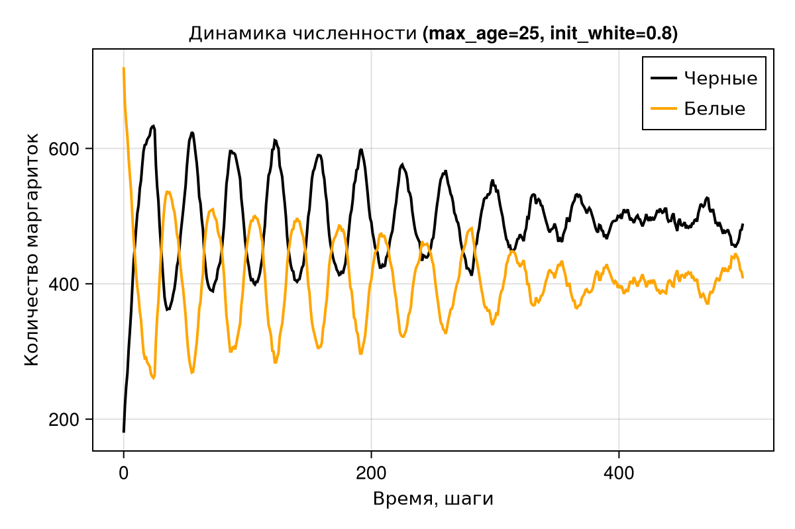
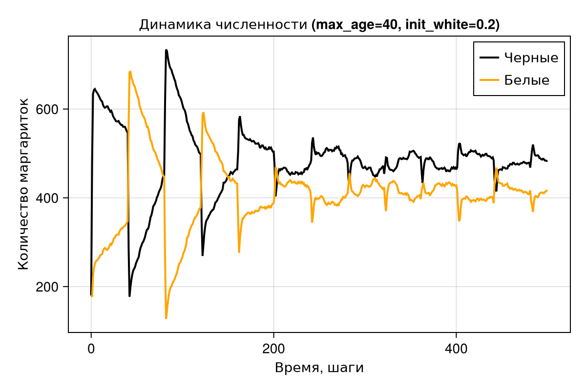
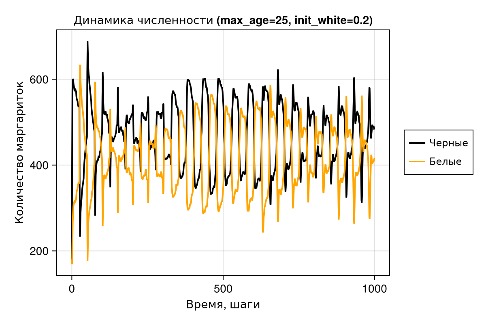
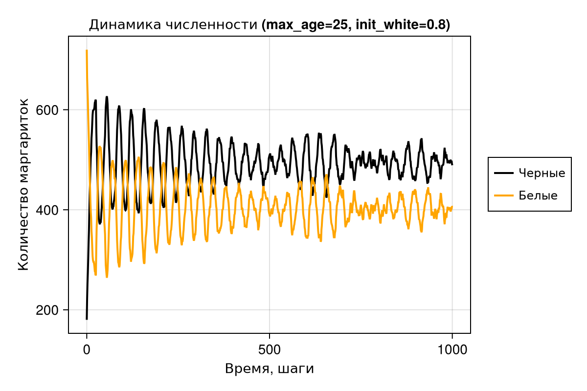
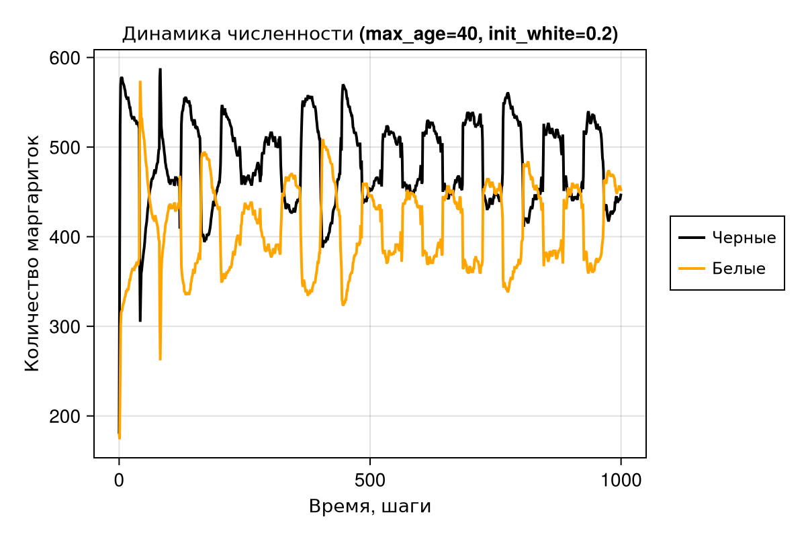
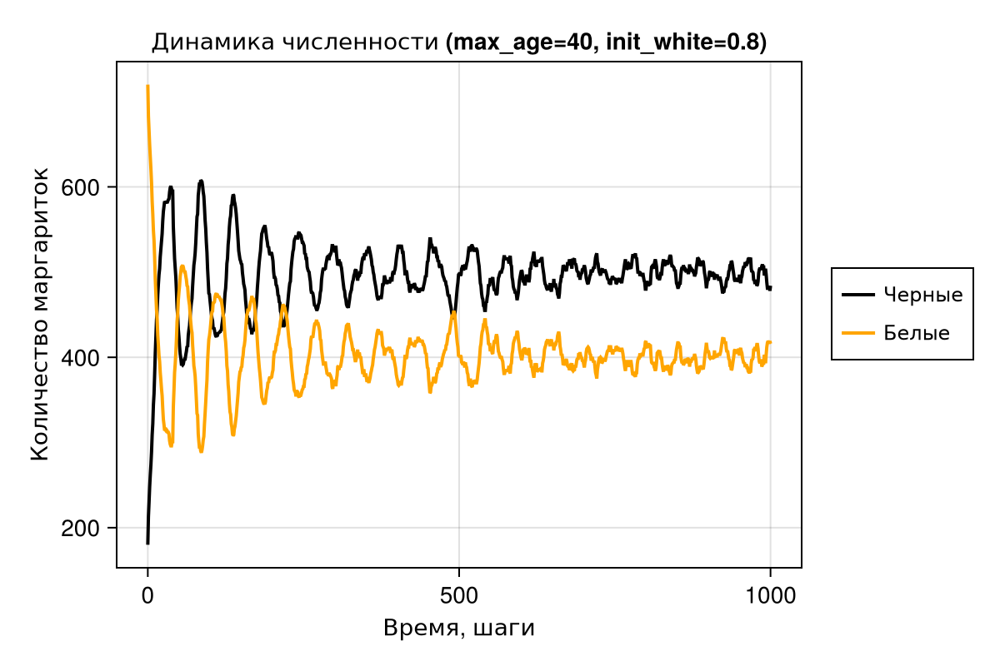

---
## Front matter
lang: ru-RU
title: Лабораторная работа №3
subtitle: "Агентное моделирование"
author:
  - Еремина О. А.
institute:
  - Российский университет дружбы народов, Москва, Россия
date: 20 марта 2026

## i18n babel
babel-lang: russian
babel-otherlangs: english

## Formatting pdf
toc: false
toc-title: Содержание
slide_level: 2
aspectratio: 169
section-titles: true
theme: metropolis
header-includes:
 - \metroset{progressbar=frametitle,sectionpage=progressbar,numbering=fraction}
 - \usepackage{fontspec}
 - \setmainfont{FreeSerif}
 - \setsansfont{FreeSans}
 - \setmonofont{FreeMono}
 - \usepackage{polyglossia}
 - \setmainlanguage{russian}
 - \setotherlanguage{english}
---

## Докладчик

:::::::::::::: {.columns align=center}
::: {.column width="70%"}

  * Еремина Оксана Андреевна
  * студентка
  * группа НКНбд-01-23
  * Российский университет дружбы народов
  * [1132236056@rudn.ru](mailto:1132236056@rudn.ru)
  * <https://github.com/oaeremina>

:::
::: {.column width="30%"}

:::
::::::::::::::

# 1. Цель работы
Изучить модель гармонического осциллятора, исследовать три режима колебаний (без затухания, с затуханием, вынужденные колебания), освоить методы решения дифференциальных уравнений в Julia и параметрический анализ.

---

# 2. Этапы выполнения

### 2.1 Базовая визуализация

На рис. 1-3 представлена визуализация модели на разных шагах симуляции.

{#fig:step1 width=70%}

{#fig:step5 width=70%}

{#fig:step45 width=70%}

# 2. Этапы выполнения

### 2.2 Анализ численности маргариток

На рис. 4 представлена динамика численности черных и белых маргариток.

{#fig:count width=100%}

# 2. Этапы выполнения

### 2.3 Влияние солнечной активности

На рис. 5 представлено влияние солнечной активности на динамику модели.

{#fig:luminosity-ramp width=100%}

{#fig:luminosity-change width=100%}

# 2. Этапы выполнения

### Исследование 1: Базовая параметрическая визуализация

{#fig:param1 width=100%}

{#fig:param2 width=100%}

{#fig:param3 width=100%}

{#fig:param4 width=100%}

# 2. Этапы выполнения

### Исследование 2: Параметрическое исследование численности

Графики для различных комбинаций параметров представлены на рис. 6-9.

{#fig:count1 width=100%}

{#fig:count2 width=100%}

{#fig:count3 width=100%}

{#fig:count4 width=100%}

# 2. Этапы выполнения

#### Исследование 3: Комплексное параметрическое исследование

{#fig:lumi1 width=100%}

{#fig:lumi2 width=100%}

{#fig:lumi3 width=100%}

{#fig:lumi4 width=100%}

# 2. Этапы выполнения

### 2.7. Создание отчёта
- Создан файл `report.qmd` со всеми графиками
- Добавлен список литературы (6 источников)
- Отчёт скомпилирован в PDF

# 2. Этапы выполнения

### 2.8. Отправка на GitVerse
- Код отправлен в репозиторий
- Создан релиз `lab01-v56` с отчётом и графиками

---

# 3. Выводы

В ходе выполнения лабораторной работы:

1. Была изучена парадигма агентного моделирования.
2. Реализована агентная модель Daisyworld.
3. Проведён анализ динамики системы при различных параметрах.
4. Созданы литературные скрипты и сгенерированы производные форматы.
5. Подготовлен отчёт в формате PDF.
