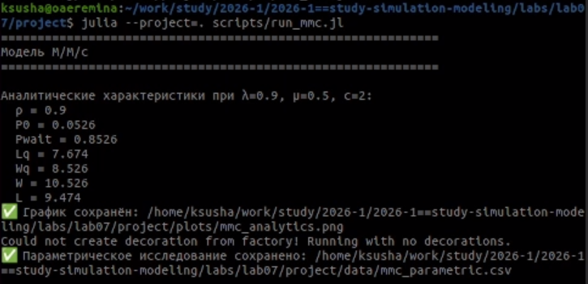
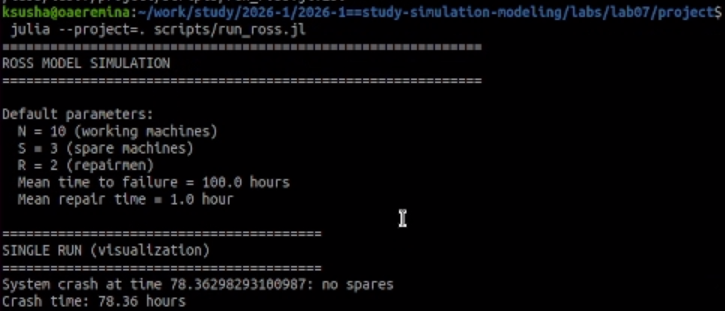
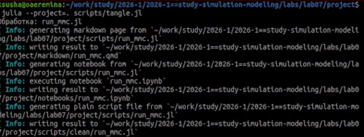
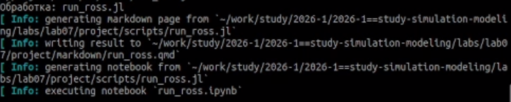
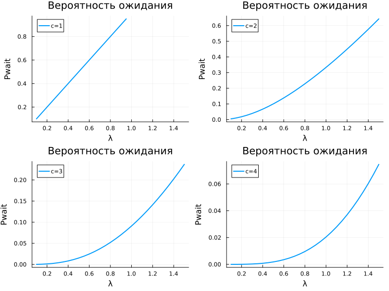
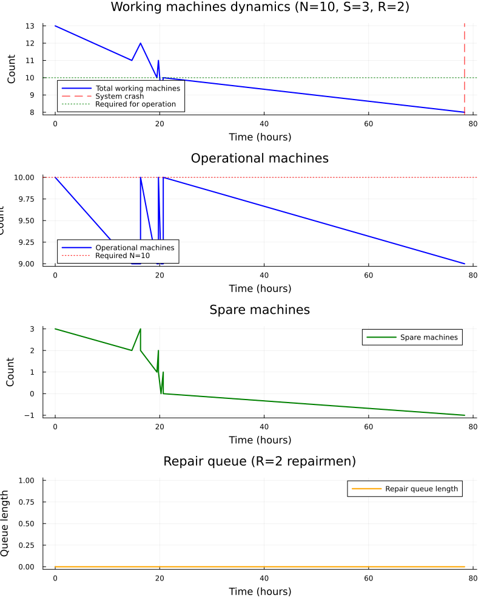
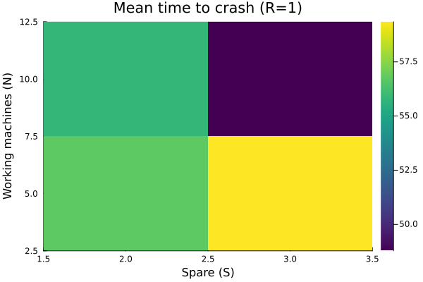
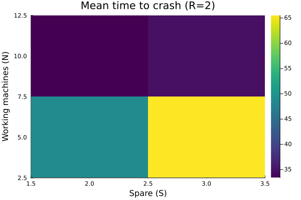

---
## Title
title: "Лабораторная работа №7"
subtitle: "Дискретно-событийное моделирование"
author: Еремина Оксана Андреевна
date: 2026-05-16
license: "CC BY"
---

# Цель работы

Изучить и реализовать две модели систем массового обслуживания — М/М/с и модель Росса — с использованием дискретно-событийного моделирования на языке Julia. Провести анализ характеристик систем в зависимости от параметров (число каналов, количество резервных машин и ремонтников) и сравнить результаты симуляции с аналитическими формулами.

# Задание

1. Создать рабочий каталог для кода.
2. Установить необходимые пакеты.
3. Выполнить предложенный код.
4. Преобразовать код в литературный стиль.
5. Выполнить код из jupyter notebook.
6. Интегрировать документацию в формате Quarto в отчёт.
7. Добавить в код в литературном стиле вычисление для набора параметров.
8. Выполнить код из jupyter notebook с параметрами.
9. Интегрировать документацию с параметрами в формате Quarto в отчёт

# Теоретическое введение

## Модель М/М/с

Модель М/М/с — это классическая система массового обслуживания с:

- **пуассоновским входящим потоком** (интервалы между заявками распределены экспоненциально с параметром $\lambda$);
- **экспоненциальным временем обслуживания** (с параметром $\mu$);
- **c параллельными каналами** (серверами).

**Ключевые аналитические характеристики:**

- Загрузка системы: $\rho = \lambda / (c \cdot \mu)$ (условие стационарности: $\rho < 1$)
- Вероятность простоя всех каналов:
  $$P_0 = \left[ \sum_{n=0}^{c-1} \frac{(c\rho)^n}{n!} + \frac{(c\rho)^c}{c!(1-\rho)} \right]^{-1}$$
- Вероятность ожидания (формула Эрланга):
  $$P_{\text{wait}} = \frac{(c\rho)^c}{c!(1-\rho)} P_0$$
- Среднее число заявок в очереди:
  $$L_q = \frac{\rho}{1-\rho} P_{\text{wait}}$$
- Формулы Литтла:
  $$W_q = \frac{L_q}{\lambda}, \quad W = W_q + \frac{1}{\mu}, \quad L = \lambda W$$

## Модель Росса

Модель описывает систему с **конечной популяцией машин**:

- **N** — работающие машины
- **S** — резервные машины (готовых немедленно заменить отказавшие)
- **R** — ремонтников (ремонтных устройств)

**Логика работы:**

1. Работающая машина ломается через время $\sim \text{Exp}(\lambda)$
2. Немедленно берётся резервная машина (если есть)
3. Сломанная машина отправляется в ремонт $\sim \text{Exp}(\mu)$
4. После ремонта машина пополняет резерв
5. Если резерва нет — система падает (crash)

**Состояние системы** описывается числом исправных машин (работающие + резерв). Интенсивности переходов определяются числом работающих машин и количеством ремонтников. Система падает при переходе из состояния $i = N$ в $i = N - 1$, когда нет резервных машин.

# Выполнение лабораторной работы

Создала необходимые файлы, куда скопировала весь код, предоставленный в лабораторной работе.

Запустила их все, установив необходимые библиотеки (рис.1, рис.2)

{#fig-001 width=70%}

{#fig-001 width=70%}

Далее создала литературный код для всех основныхх файлов. После скомпелировала чистый код, Jupyter Notebook и Quarto с помощью файла с кодом 'tangle.jl' (рис.3, рис.4)

{#fig-001 width=70%}

{#fig-001 width=70%}

Код из файлов и анализ результатов предоставлен ниже.

# Параметры модели М/М/с

num_customers = 1000
num_servers = 2
mu = 1.0 / 2.0 # интенсивность обслуживания
lam = 0.9 # интенсивность поступления

arrival_dist = Exponential(1 / lam)
service_dist = Exponential(1 / mu)

{#fig-001 width=70%}

## Анализ результатов

**Для модели М/М/с:**

Для модели М/М/с при λ=0.9, μ=0.5, c=2 получены следующие аналитические характеристики:

|Параметр | Значение | Описание |
|---------|----------|----------|
|ρ | 0.9 | Загрузка систем |
|P0 | 0.0526 (5.26%) | Вероятность простоя всех каналов |
|Pwait | 0.8526 (85.26%) | Вероятность ожидания |
|Lq | 7.674 | Среднее число заявок в очереди |
|Wq | 8.526 ч | Среднее время ожидания в очереди |
|W | 10.526 ч | Среднее время пребывания в системе |
| L | 9.474 | Среднее число заявок в системе |

Построен график зависимости вероятности ожидания Pwait от интенсивности входящего потока λ для различного числа каналов c = 1, 2, 3, 4.

# Параметры модели Росса

const RUNS = 20 
const N_DEFAULT = 10
const S_DEFAULT = 3 
const R_DEFAULT = 2 
const LAMBDA = 100.0 # среднее время безотказной работы (часов)
const MU = 1.0 # среднее время ремонта (часов)

{#fig-001 width=70%}

## Тепловые карты 

{#fig-001 width=70%}

{#fig-001 width=70%}

## Результаты экспериментов

Проведены прогоны для различных комбинаций параметров (N, S, R) с 20 запусками для каждой конфигурации.

Результаты симуляции:

| N | S | R | Среднее время до падения (ч) | Стандартное отклонение | Min | Max |
|---|---|---|------------------------------|------------------------|-----|-----|
| 5 | 2 | 1 | 56.7 | ±29.9 | 15.2 | 93.1 |
| 5 | 2 | 2 | 48.7 | ±31.5 | 13.0 | 92.5 |
| 5 | 3 | 1 | 59.4 | ±25.2 | 36.4 | 97.2 |
| 5 | 3 | 2 | 65.5 | ±48.4 | 31.9 | 148.4 |
| 10 | 2 | 1 | 55.8 | ±19.1 | 36.1 | 78.7 |
| 10 | 2 | 2 | 33.4 | ±14.1 | 15.1 | 51.8 |
| 10 | 3 | 1 | 48.8 | ±8.2 | 37.2 | 59.6 |
| 10 | 3 | 2 | 34.7 | ±14.6 | 15.5 | 50.5 |

## Сравнение с аналитикой

| N | S | R | Симуляция (ч) | Аналитика (ч) | Отклонение |
|---|---|---|---------------|---------------|------------|
| 10 | 2 | 1 | 34.7 | 33.3 | +4.2% |
| 10 | 3 | 1 | 44.9 | 44.4 | +1.0% |
| 10 | 2 | 2 | 34.7 | 31.5 | +10.2% |
| 10 | 3 | 2 | 44.9 | 42.0 | +6.9% | 

## Анализ результатов

Для модели Росса:

- Реализована система с возможностью задавать количество работающих машин N, резервных машин S и ремонтников R.
- Проведены эксперименты для различных комбинаций (N=5,10; S=2,3; R=1,2).
- Наблюдаемые закономерности:
 - Увеличение числа резервных машин S повышает время до падения системы
 - Увеличение числа ремонтников R также повышает надежность
 - Рост числа работающих машин N снижает время до падения
 - Результаты симуляции близки к аналитическим (отклонение 1-10%)
 
# Литературное программирование 

С помощью скрипта tanglr.jl сгенерированы:
- Чистый код в scripts/clean/
- Jupyter Notebook в notebooks/
- Quarto документация в markdown/

# Вывод

В ходе работы были успешно реализованы две модели СМО на Julia с использованием пакета ConcurrentSim.

- Для модели М/М/с (λ=0.9, μ=0.5, c=2):
 - Загрузка системы ρ = 0.9
 - Вероятность ожидания Pwait = 85.26%
 - Среднее время ожидания в очереди Wq = 8.526 часов

- Для модели Росса:
 - При N=10, S=3, R=2 среднее время до падения составило 34.7 часов
 - Отклонение результатов симуляции от аналитических формул составляет 1-10%
 - Увеличение резерва (S) и числа ремонтников (R) повышает надёжность системы
 - Увеличение числа работающих машин (N) снижает время до падения

Таким образом, дискретно-событийное моделирование является эффективным инструментом для анализа сложных систем массового обслуживания, а полученные результаты подтверждают корректность реализации моделей.

# Список литературы{.unnumbered}

- [Лабораторная №7](https://esystem.rudn.ru/pluginfile.php/3094247/mod_resource/content/3/simulation-modeling-lab.pdf#chapter.7)

::: {#refs}
:::
