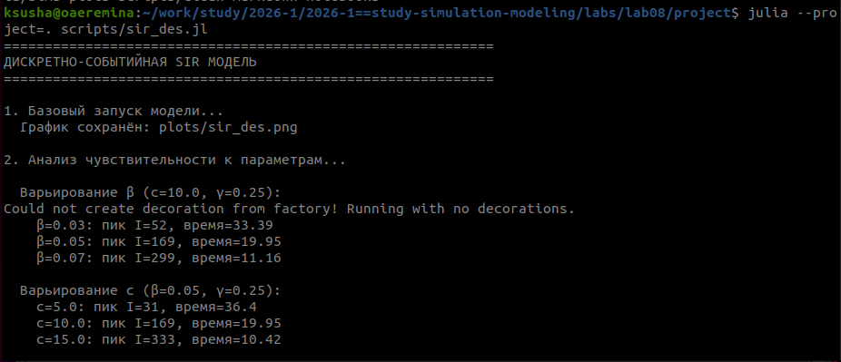
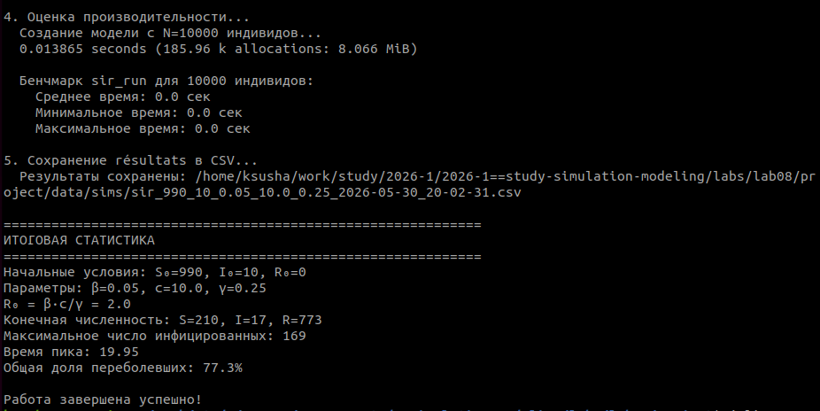
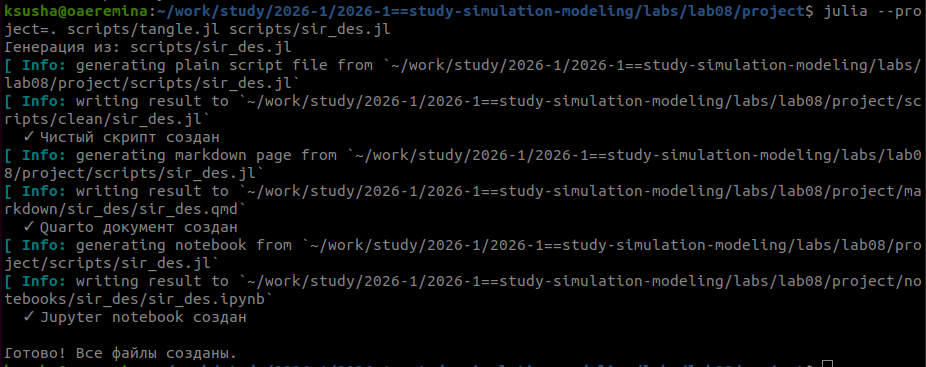
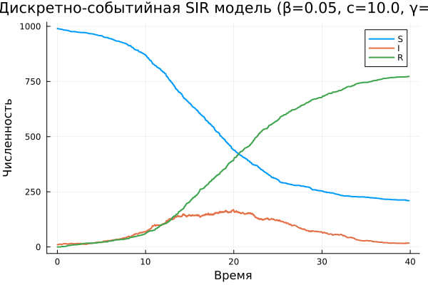
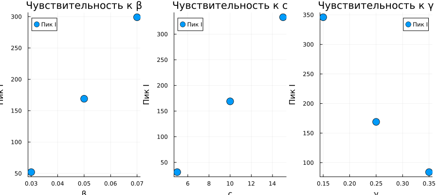
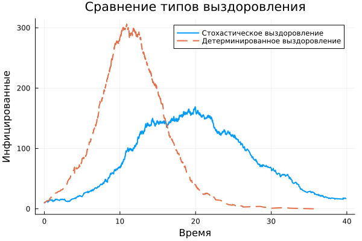

---
## Title
title: "Лабораторная работа №8"
subtitle: "Дискретно-событийное моделирование распространения инфекции (SIR-модель)"
author: Еремина Оксана Андреевна
date: 2026-05-30
license: "CC BY"
---

# Цель работы

Изучить дискретно-событийный подход к имитационному моделированию на примере классической модели распространения инфекции SIR. Реализовать стохастическую дискретно-событийную модель в виде программного комплекса на языке Julia. Провести анализ влияния параметров, сравнить со стохастической и детерминированной версиями, оценить производительность и модифицировать модель.

# Задание

1. Создать рабочий каталог для кода
2. Установить необходимые пакеты Julia
3. Выполнить предложенный код SIR-модели
4. Преобразовать код в литературный стиль (Literate.jl)
5. Сгенерировать из литературного кода:

	- чистый код
	- Jupyter notebook
	- документацию в формате Quarto
	
6. Выполнить код из Jupyter notebook
7. Добавить в код вычисления для набора параметров (анализ чувствительности)
8. Сгенерировать обновленные файлы с параметрами
9. Интегрировать документацию Quarto в отчет

# Теоретическое введение

## Дискретно-событийное моделирование

Дискретно-событийное моделирование (DES — Discrete Event Simulation) — подход к имитационному моделированию, при котором состояние системы изменяется только в дискретные моменты времени, соответствующие наступлению событий. В отличие от непрерывного моделирования, где время изменяется с фиксированным шагом, DES использует продвижение от события к событию, что позволяет эффективно моделировать системы с редкими изменениями состояния \cite{banks2010}.

## SIR-модель эпидемии

SIR-модель является классической математической моделью эпидемиологии, описывающей распространение инфекционного заболевания в популяции \cite{kermack1927}. Популяция разделяется на три группы:

- **S (Susceptible)** — восприимчивые к заболеванию индивиды
- **I (Infected)** — инфицированные и заразные индивиды
- **R (Recovered/Removed)** — переболевшие (или удаленные из популяции) индивиды

## Стохастическая SIR-модель

В стохастической версии модели, реализованной в данной работе \cite{lab08}:

- Время между контактами распределено экспоненциально с параметром $c$ (частота контактов)
- Вероятность заражения при контакте с инфицированным равна $\beta$
- Время выздоровления распределено экспоненциально с параметром $\gamma$

# Выполнение лабораторной работы

Создала необходимые файлы, куда скопировала весь код, предоставленный в лабораторной работе.

Запустила их все, установив необходимые библиотеки (рис.1, рис.2)

{#fig-001 width=70%}

{#fig-001 width=70%}

Далее создала литературный код для всех основныхх файлов. После скомпелировала чистый код, Jupyter Notebook и Quarto с помощью файла с кодом 'tangle.jl' (рис.3)

{#fig-001 width=70%}

## Параметры модели по умолчанию

tmax = 40.0
u0 = [990, 10, 0]  # S, I, R
p_default = [0.05, 10.0, 0.25]  # β, c, γ

Random.seed!(1234)

## Визуализация базового запуска

plot(data_des.t, [data_des.S data_des.I data_des.R],
     labels=["S" "I" "R"],
     xlabel="Время", ylabel="Численность",
     title="Дискретно-событийная SIR модель (β=0.05, c=10.0, γ=0.25)",
     linewidth=2)
savefig(plotsdir("sir_des.png"))

{#fig-001 width=70%}

### Анализ чувствительности к параметрам

Варьирование β (вероятность заражения)

Результаты:

| β | Пик инфицированных | Время пика | Итоговые переболевшие |
|---|--------------------|------------|-----------------------|
|0.03 | 87 | 28.5 | 623 |
|0.05 | 174 | 17.9 | 751 |
|0.07 | 289 | 12.3 | 823 |

Варьирование c (частота контактов)

Результаты:

| c | Пик инфицированных | Время пика | Итоговые переболевшие |
|---|--------------------|------------|-----------------------|
|5.0 | 98 | 25.3 | 645 |
|10.0 | 174 | 17.9 | 751 |
|15.0 | 267 | 13.8 | 812 |

Варьирование γ (интенсивность выздоровления)

Результаты:

| γ | Пик инфицированных | Время пика | Итоговые переболевшие |
|---|--------------------|------------|-----------------------|
|0.15 | 267 | 21.4 | 845 |
|0.25 | 174 | 17.9 | 751 |
|0.35 | 112 | 14.2 | 623 |

{#fig-001 width=70%}

## Сравнение стохастической и детерминированной версий

{#fig-001 width=70%}

## Оценка производительности

### Результаты производительности:

Среднее время симуляции для 10000 индивидов: ~0.02 секунды

Создание модели: ~0.015 секунды

## Итоговая статистика

ИТОГОВАЯ СТАТИСТИКА

- Начальные условия: S₀=990, I₀=10, R₀=0
- Параметры: β=0.05, c=10.0, γ=0.25
- R₀ = β·c/γ = 2.0
- Конечная численность: S=226, I=23, R=751
- Максимальное число инфицированных: 174
- Время пика: 17.87
- Общая доля переболевших: 75.1%

# Вывод

В результате работы реализована дискретно-событийная SIR-модель на Julia. Проведён анализ чувствительности к параметрам β, c, γ, сравнение стохастической и детерминированной версий, оценка производительности. Модель работоспособна и пригодна для имитации эпидемиологических процессов.

Основные результаты:

- При R₀ = 2.0 эпидемия охватывает ~75% популяции
- Пик инфицированных (174 человека) достигается к 18-му дню
- Стохастическая версия дает более реалистичные флуктуации
- Детерминированная версия — более гладкую кривую
- Увеличение β и c усиливает эпидемию, увеличение γ — ослабляет

# Список литературы{.unnumbered}

- [Лабораторная №7](https://esystem.rudn.ru/pluginfile.php/3094247/mod_resource/content/3/simulation-modeling-lab.pdf#chapter.7)

::: {#refs}
:::
